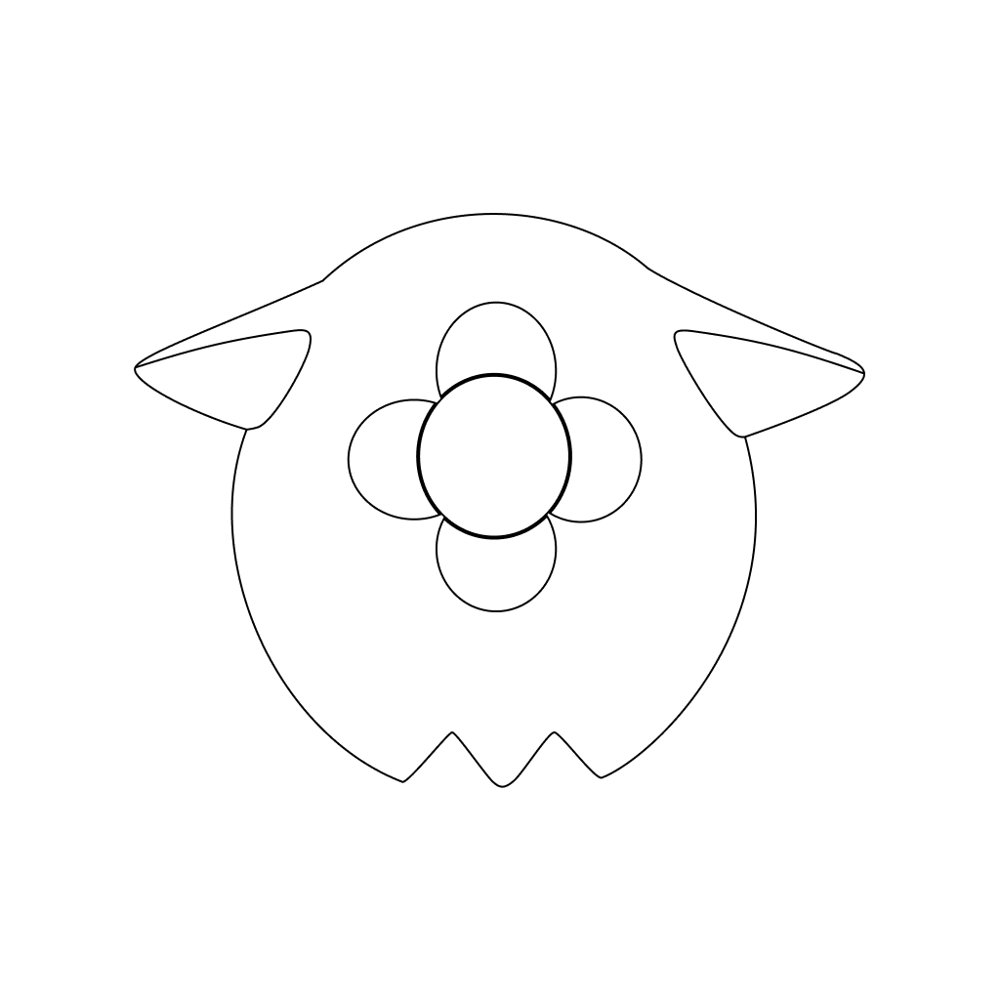

   

<h1 align="center">Otomo (Site)</h1>

The (lazily built) endpoint (and maybe soon site) for the Otomo application.

## About
This is meant as a endpoint for livestream and channel data for the Otomo app. Although the application is able to fetch streams directly from Holodex, certain features, such as channels may be updated through community based contributions which requires this helper instead. As a fallback, livestreams may be fetched through here as well.

## Usage
Currently this is meant only for use within the Otomo application [here](https://github.com/ProgrammingPleb/otomo-app).  
You may find the installation instructions for the application with the [README file](https://github.com/ProgrammingPleb/otomo-app#getting-started).

## Contributing
Any contributions are widely appreciated! (although I won't expect any for this application)  

### Data
We're currently aggregating the channels data in this Google Sheet [here](https://docs.google.com/spreadsheets/d/1GgH2LddekHNNuxkqqwCYjOH5PTE_zPc9IDci6ZOjuAg/edit?gid=170655564#gid=170655564)!  
If you do not have expertise in programming, don't worry, you may still be able to help out here! Some of the channels may show incorrect data, and you can contribute by correcting such data through this sheet here.  
As contributions here are reviewed manually, some of the changes might take longer than expected for them to reflect in the sheet.

### Code
As stated within the `AGENTS.md` file, this project is meant to be **a human-made, hand written project**. Thus, I'd really appreciate it if the contributions themselves also follow this convention. Although AI makes things easier by dealing with boilerplate code and other things, I believe that (after being stuck in that phase of relying on AI) after a while you tend to not keep track of what they're doing, and thus, I'd like to keep this policy in place.  
If you do read it however, using them as a learning tool may be permitted, as we humans do tend to maybe not be able to grasp certain conventions or concepts as easily (which is understandable). In that situation, having AI to explain why issues such as "why using `useEffect` here causes the application's navigation to bug out" with context to the codebase would immensely help in a way.  

To help contribute to the project, please do the following:  
1. Fork the project
2. Create a branch following the naming conventions [here](https://conventionalbranch.org/)
3. Make your changes and commit them following the naming conventions [here](https://www.conventionalcommits.org/en/v1.0.0/)
4. Push the changes to your branch
5. Open a Pull Request

My available times are usually around 6:30pm to 12:00am GMT+8 time so I may reply late, so I do apologize for those in advance!

## License
This project is licensed under the `GNU GPLv3` license. Please read `LICENSE` for more information.

## Contact
If you need to reach me out privately, you may do so by emailing me at [dev@pleb.moe](mailto:dev@pleb.moe). I may take a while to respond back, so your patience is very much appreciated!

## Acknowledgement
I'd like to thank these parties in making this application happen (either directly or indirectly):
- Friends from the local NIJISANJI community
- [Holodex](https://holodex.net) for their generosity in making their API open for others
